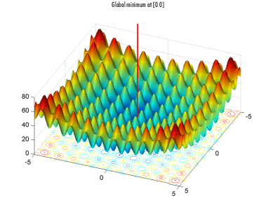
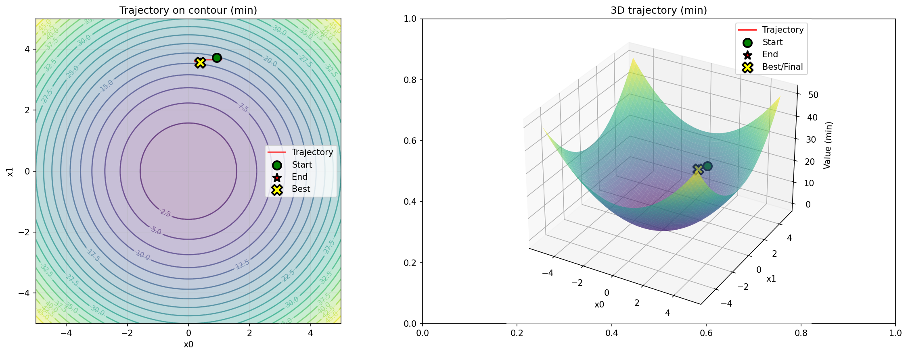
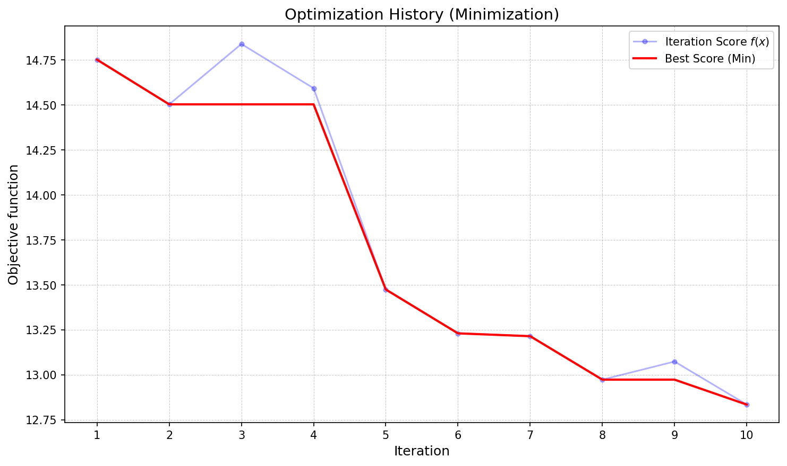

# HPO_RL: Гибридные Методы Оптимизации Гиперпараметров c использованием методов Обучения с Подкреплением

Фреймворк для решения задачи оптимизации гиперпараметров (Hyperparameter optimization, HPO).
Позволяет использовать классические алгоритмы, а также алгоритмы на основе методов обучения с подкреплением (Reinforcement learning, RL) для подбора гиперпараметров.

## Руководитель проекта 

- Парфенов Денис Васильевич, promasterden@yandex.ru

## Участники проекта

- Петерс Е. А., Coolercool47@yandex.ru - Тимлид, RL алгоритмы и фреймворк
- Матков Н. К., nikgenom@mail.ru - Разработчик, RL алгоритмы и фреймворк
- Тимошин Э. К., edik.timoshin@gmail.com - Разработчик, классические алгоритмы и фреймворк

## Описание проекта

Данный проект посвящен исследованию возможности применения методов RL для создания алгоритмов оптимизации гиперпараметров.

### Цель исследования

Разработка и экспериментальная оценка применения методов обучения с подкреплением для оптимизации гиперпараметров в различных нейросетевых алгоритмах.

### Основные задачи

- **Исследование современных методов оптимизации гиперпараметров**
- **Разработка алгоритмов использующих RL агентов для оптимизации гиперпараметров и сред для них** 
- **Анализ и оценка работы HPO RL в сравнении с классическими методами оптимизации** 

## Функциональность фреймворка

Фреймворк предлагает решение различных возможных задачи оптимизации:

- **Тестовые функции** - различные по сложности функции на которых тестируются алгоритмы оптимизации (например, функция Растригина)


- **Тестовые и добавляемые модели (Pytorch)** - модели, обучаемые на стандартном цикле обучения написанные на фреймворке Pytorch
- **Целевая функция** - гибкий контракт, которая предлагает пользователю самому написать функцию, которую необходимо оптимизировать, что позволяет использовать различные фреймворки ML и оптимизации

Эти задачи можно решать при помощи следующих алгоритмов

### Классические методы оптимизации гиперпараметров

- **Tree-Structured Parzen Estimator** - [ссылка на статью](https://proceedings.neurips.cc/paper/2011/file/86e8f7ab32cfd12577bc2619bc635690-Paper.pdf)
- **Hyperband** - [ссылка на статью](https://arxiv.org/abs/1603.06560)
- **Bayesian Optimization HyperBand** - [ссылка на статью](https://arxiv.org/abs/1807.01774)

### Алгоритмы на основе RL

- **Алгоритмы использующие скользящее окно**: Deep Q-network (DQN), Proximal Policy Optimization (PPO) и Soft Actor-Critic (SAC)
- **Алгоритмы использующие реккурентные сети**: Recurrent Proximal Policy Optimization (RecurrentPPO)

#### Для работы этих алгоритмов на данный момент сформированы следующие среды:
- **CyclePipelineEnv** - среда предлагающая циклический перебор гиперпараметров - за каждый шаг агента изменяется только один гиперпараметр в выбранных пределах, притом гиперпараметры для изменения выбираются по очереди. Эта постановка фактически предлагает использовать покоординатный спуск, но не требует дифференцируемости целевой функции, что позволяет использовать ее в задаче.

## Визуализация и логгирование

для 2d задач - графики в 2d и 3d 
Для всех - график изменения целевой метрики (функция потерь или метрика качества модели)

2d и 3d графики

График траектории



Логгирование в .csv и .tex в виде таблицы исследованных точек 

```
Iteration,x0,x1,Objective
1,0.9197326,3.7290974,14.752075
2,0.9197326,3.695652,14.503752
3,1.086956,3.695652,14.839317
4,1.086956,3.6622066,14.593231
5,0.2508359,3.6622066,13.474676
6,0.2508359,3.6287622,13.230834
7,0.21739101,3.6287622,13.215174
8,0.21739101,3.5953178,12.97357
9,0.3846159,3.5953178,13.07424
10,0.3846159,3.5618725,12.834865
```

## Установка

```bash
pip install git+https://github.com/Coolercool47/HPO_RL.git@refactored_project
```

## Удаление 
```bash
pip uninstall hpo_rl
```

## Структура

```
HPO_RL/
├───.github/
│   └───workflows/
├───docs/
│   └───source/
│       ├───generated/
│       └───_static/
├───hpo_rl/
│   ├───backends/
│   │   └───__pycache__/
│   ├───baselines/
│   │   └───__pycache__/
│   ├───configs/
│   │   └───depricated/
│   ├───controller/
│   ├───core/
│   │   └───__pycache__/
│   ├───data_processing/
│   ├───environments/
│   ├───experiments/
│   ├───main_scripts/
│   │   └───__pycache__/
│   ├───models/
│   │   └───__pycache__/
│   ├───trainers/
│   │   └───__pycache__/
│   └───__pycache__/
├───image/
├───tests/
├── requirements.txt
├── run_experiment_objective.py
├── run_experiment.ipynb
├── run_experiment.py
├── pyproject.toml
├── setup.py
└── README.md
```

## Запуск

Эксперимент с настраивоемой конфигурацией по обучению алгоритма hpo_rl оптимизировать гиперпараметры заданной функции.
```bash
python run_experiment.py
```
Пример конфигурации:
```
{
    "algorithm": {
        "name": "PPO", 
        "verbose": 1,
        "gamma": 0.95,
        "learning_rate": 0.001,
        "total_timesteps": 1000,
        "inference_timesteps": 100,
        "n_steps": 1000,
        "batch_size": 500,
        "policy": "MultiInputPolicy"
    },
    "env": {
        "name": "cycle_move_pipeline",
        "num_bins": 300,
        "max_steps": 10,
        "reward_mode": "per_step",
        "step_sizes": [1, 5, 25]
    },
    "backend": {
        "name": "function",
        "function": "sphere",
        "dimensions": 2
    }
}
```

Эксперимент с настраивоемой конфигурацией по обучению алгоритма hpo_rl оптимизировать гиперпараметры простой модели сверточной нейронной сети (Convolutional Neural Network, CNN) обучаемой на датасете CIFAR100.
```bash
python run_experiment_objective.py
```
Пример конфигурации:
```
{
    "algorithm": {
        "name": "BOHB",
        "R": 2,
        "nu": 2,
    },
    "backend": {
        "name": "objective",
        "num_epochs": 1,
        "objective_function": objective_function,
        "hp_space": {
            "lr": {
                "type": "float", 
                "min": 1e-6,
                "max": 1e-2
            },
            "batch_size": {
                "type": "categorical", 
                "values": [32, 64, 128]
            },
            "optimizer": {
                "type": "categorical", 
                "values": ["Adam", "SGD"]
            },
            "n_params": {
                "type": "categorical", 
                "values": [16, 32, 64] 
            }
        }
    }
}
```

Пример objective_function:
```
def objective_function(config, dict_config):
    param_values = {}
    for name in dict_config.keys():
        param_values[name] = config[name]

    n_params = param_values["n_params"]
    lr = param_values["lr"]
    batch_size = int(param_values["batch_size"])
    optimizer_name = param_values["optimizer"]

    transform = transforms.ToTensor()
    
    try:
        dataset = datasets.CIFAR100(root='./tmp_data', train=True, download=True, transform=transform)
    except:
        dataset = datasets.CIFAR100(root='./tmp_data', train=True, download=False, transform=transform)
        
    train_size = int(0.8 * len(dataset))
    val_size = len(dataset) - train_size
    train_dataset, val_dataset = random_split(dataset, [train_size, val_size])

    train_loader = DataLoader(train_dataset, batch_size=batch_size, shuffle=True)
    val_loader = DataLoader(val_dataset, batch_size=batch_size, shuffle=False)

    model = SimpleCNN(num_classes=100, n_params=n_params) 
    
    device = torch.device("cuda" if torch.cuda.is_available() else "cpu")
    model.to(device)

    criterion = nn.CrossEntropyLoss()
    if optimizer_name == "Adam":
        optimizer = optim.Adam(model.parameters(), lr=lr)
    else:
        optimizer = optim.SGD(model.parameters(), lr=lr)

    model.train()
    
    sub_bar = tqdm(total=int(2),desc="Model training", position=1, leave=False)
    
    for epoch in range(int(2)):
        for X, y in train_loader:
            X, y = X.to(device), y.to(device)
            optimizer.zero_grad()
            outputs = model(X)
            loss = criterion(outputs, y)
            loss.backward()
            optimizer.step()
        sub_bar.update(1)
    
    sub_bar.close()

    model.eval()
    val_loss, correct = 0.0, 0
    with torch.no_grad():
        for X, y in val_loader:
            X, y = X.to(device), y.to(device)
            outputs = model(X)
            loss = criterion(outputs, y)
            val_loss += loss.item()
            preds = outputs.argmax(dim=1)
            correct += (preds == y).sum().item()

    avg_val_loss = val_loss / len(val_loader)
    val_accuracy = correct / len(val_dataset)

    print(f"Config: {param_values}, ValLoss: {avg_val_loss:.4f}, ValAcc: {val_accuracy:.4f}")

    return avg_val_loss
```
## Подробная документация
Находится в процессе развертывания, но фактически её версия на данный момент находится в папке docs